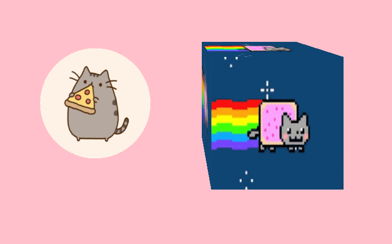

# AFrame GIF Component

Display GIF as a material for [A-Frame](https://aframe.io) VR. Requires [`draw`](https://github.com/maxkrieger/aframe-draw-component).
Inspired by [@gtk2k](https://github.com/gtk2k)'s [awesome sample](https://github.com/gtk2k/gtk2k.github.io/tree/master/animation_gif)



## Properties

| Property | Description | Default Value |
| -------- | ----------- | ------------- |
|`src`|image url|null|
|`autoplay`|play automatecally once it's ready|true|

## Method

### Global method

`play ()`

Play gif animation

```js
entity.play()
```

`pause ()`

Pause gif animation

```js
entity.pause()
```

### Custom method

`togglePlayback ()`

Toggle playback. if the gif is paused, play and pause if it's playing.

```js
entity.components.gif.togglePlayback()
```

`nextFrame ()`

Go to next frame. Useful if it's paused.

```js
entity.components.gif.nextFrame()
```


`paused ()`

Get if it is paused.

```js
const paused = entity.components.gif.paused() // true or false
```


## Usage

### Browser Installation

Install and use by directly including the [browser files](dist):

```html
<head>
  <title>My A-Frame Scene</title>
  <script src="https://aframe.io/releases/0.2.0/aframe.min.js"></script>
  <script src="https://rawgit.com/maxkrieger/aframe-draw-component/master/dist/aframe-draw-component.min.js"></script>
  <script src="https://rawgit.com/mayognaise/aframe-gif-component/master/dist/aframe-gif-component.min.js"></script>
</head>

<body>
  <a-scene>
    <a-entity geometry="primitive: box" draw="" gif="src:nyancat.gif;"></a-entity>
  </a-scene>
</body>
```

### NPM Installation

Install via NPM:

```bash
npm i -D aframe-draw-component aframe-gif-component
```

Then register and use.

```js
import 'aframe'
import draw from 'aframe-draw-component'
AFRAME.registerComponent('draw', draw.component)
import 'aframe-gif-component'
```


